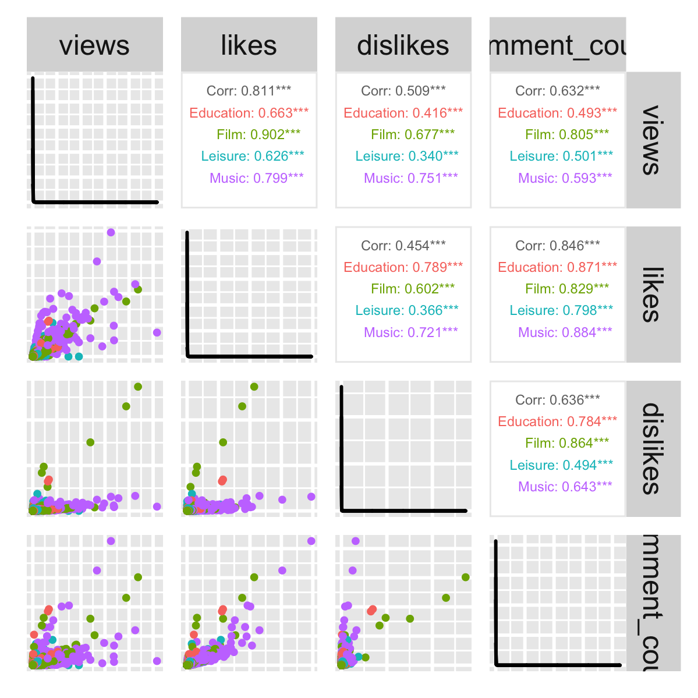

```{r setup, include=FALSE}
knitr::opts_chunk$set(echo = TRUE, fig.align = "center")
library(dplyr)
library(stringr)
library(moments)
library(kableExtra)
library(GGally)
load("dataset.RData")
```

\newpage

\tableofcontents

\newpage

# Introduction

## Topic and motivation

The aim of this project is to analyze what are the most favorite YouTube videos with respect each category. These trends can be measured with quantifiers such as the number of accumulated views, the number of accumulated likes, the number of accumulated dislikes and the number of accumulated comments. Therefore, the higher the value of any of these parameters, the more likely to be in the top of the trendiest videos.

## Description of the dataset

Data comes from [Kaggle](https://www.kaggle.com/datasets/datasnaek/youtube-new) separate by countries and we has merged all of them into a single csv file. As it is commented in the previous website, the information was obtained through the [YouTube API](https://developers.google.com/youtube/v3). 

The csv file we uploaded at the beginning of the course contains 375,942 rows and 10 variables. It describes the 200 top trending YouTube videos per day for some different countries: United States of America, Canada, Mexico, Japan, South Korea, India, Russia, United Kingdom, France and Germany. Not all countries have the same interval of time. YouTube videos do not have the same period of time between each other either. Let's see the data grouped in the Table \ref{tab:show_original_data}, aggregated the dates for each group (`vide_id` and `category_id`).


```{r show_original_data, echo = FALSE, cache=TRUE}
# 1.

## Show original data: dates per video_id and country_id

diff_dates <- youtube %>% 
  group_by(country_id, video_id) %>% 
  mutate(trending_dates = paste0(trending_date, collapse = "|")) %>% 
  distinct(trending_dates) %>% 
  data.frame

knitr::kable(head(diff_dates), caption = "Original data example") %>% 
  row_spec(0, bold=TRUE) %>% 
  kable_styling(latex_options = "HOLD_position", font_size = 7)

```

Then it is clear that the record dates depend on the `video_id` and the `country_id`. For example, in the original data the interval times for Canada, US, Germany, FR, UK, India, South Korea, Mexico and Russia are from 14-11-2017 to 14-06-2018 and for Japan from 07-02-2018 to 14-06-2018.

Therefore, due to the fact that time-series is not allowed for the purpose of this project, we are going to consider the last registered date time observation for a specific `video_id` and `country_id`. 

Besides that, we are applying a couple of tweaks to have our data ready for the analysis. First, we are going to modify the type of a few variables:

- `trending_date` from character to Date class
- `category_id` from integer to factor class
- `country_id` from integer to factor class
- `comments_disables` from character to factor class

Secondly, in order to have available a continuous variable, we are going to change the value of the variable `views` to be measured in miles. Lastly, we are filling in the missing values for the variable `comments_disables` (setting `0` when there are comments and `1` when the number of comments is zero) and removing the variables that we are not going to use afterwards such as `trending_date` and `tags`. 

After all of these changes our modified dataset contains 207,148 rows.

```{r initial_changes, cache=TRUE, include = FALSE}

# Applying changes to the original data. Change type of variables (date, factor)

data <- youtube %>% 
  mutate(
    trending_date = as.Date(trending_date, '%y.%d.%m'),
    category_id = as.factor(category_id),
    country_id = as.factor(country_id),
    comments_disabled = factor(ifelse(is.na(comments_disabled), NA, 
                                      ifelse(comments_disabled=="True", 1, 0)))
    ) %>% 
  group_by(video_id, country_id) %>% 
  slice(which.max(trending_date)) %>% 
  select(-c(trending_date, tags)) %>% 
  data.frame

data$comments_disabled[is.na(data$comments_disabled)] <- 
  ifelse(data[is.na(data$comments_disabled),]$comment_count==0, 1, 0)
data$views = data$views/1000

```


## Description of the population

Observing some blogs about the YouTube's figures for 2018, we can say that the total number of YouTube videos approximately was around 8 billion videos. A significantly large population size comparing with the sample size of our data that is just 207,148 observations, then the population size is totally different from the sample size.

The total number of videos in YouTube at the time where the last observation was recorded vary based on the country. Considering the number of active users per country we could approximate the total videos for each market, however this value would not be accurate at all. We have obtained the number of observations we have for each country and visualized them in the Table \ref{tab:videos_per_country}.

```{r videos_per_country, echo = FALSE, cache=TRUE}

# Visualize the number of videos per country

count <- data %>% 
  group_by(country_id) %>% 
  summarise(n = n())

knitr::kable(count, caption = "Number of videos per country") %>% 
  row_spec(0, bold=TRUE) %>% 
  kable_styling(latex_options = "HOLD_position", font_size = 7)

```

We could see in the table above that UK and US have a smaller number of observations, nevertheless it does not mean that they have less videos, it could be that they have a large number of videos repeated (consecutive days appeared in the 200 trendiest videos).

We would like to extrapolate our results (top 200 trending videos per day) to the whole population of YouTube videos. At the beginning just for the whole YouTube and later on segmented by country.

## Description of the variables

The dataset has 8 dimensions, these variables are:

- `video_id` (*qualitative nominal variable*) unique identifier for a YouTube video, it is a string of characters of length 11.
- `category_id` (*qualitative nominal variable*) unique identifier for video's category. The mapping between categories and ids is the following one: Film & Animation (`1`), Autos & Vehicles (`2`), Music (`10`), Pets & Animals (`15`), Sports (`17`), Travel & Events (`19`), Gaming (`20`), People & Blogs (`22`), Comedy (`23`), Entertainment (`24`), News & Politics (`25`), Howto & Style (`26`), Education (`27`), Science & Technology (`28`), Nonprofits & Activism (`29`), Movies (`30`), Shows (`43`) and Trailers (`44`).
- `view` (*quantitative continuous variable*) number of views, measured in miles, up to the last record's date for a specific video and country.
- `likes` (*quantitative discrete variable*) number of likes up to the last record's date for a specific video and country
- `dislikes` (*quantitative discrete variable*) number of dislikes up to the last record's date for a specific video and country
- `comments_count` (*quantitative discrete variable*) number of comments up to the last record's date for a specific video and country.
- `comments_disabled` (*qualitative binary variable*) whether the comments are enabled or not, represented as `0` if it is false and `1` if it is true.
- `country_id` (*qualitative nominal variable*) unique identifier for the country where the video is hosted. It consists a string of characters of length 2. The mapping between countries and ids is the following one: United States of America (`US`), Canada (`CA`), Mexico (`MX`), Japan (`JP`), South Korea (`KR`), India (`IN`), Russia (`RU`), United Kingdom (`GB`), France (`FR`) and Germany (`DE`).

As it is indicated in the guide project, we are going to reduce the number of factors for the categorical variables we have: `category_id` and `country_id`. For the first variable, we are going to merge those factors that are intimately related to, having:

- `Film`, that includes: Film & Animation (`1`), Comedy (`23`), Entertainment (`24`), Movies (`30`), Shows (`43`) and Trailers (`44`).
- `Music`, that is just Music (`10`).
- `Education`, that is formed by News & Politics (`25`), Howto & Style (`26`), Education (`27`), Science & Technology (`28`) and Nonprofits & Activism (`29`).
- `Leisure`, that includes: Autos & Vehicles (`2`), Pets & Animals (`15`), Sports (`17`), Travel & Events (`19`), Gaming (`20`) and People & Blogs (`22`).

The number of factors of the variable `country_id` can be reduced using the continent associated instead of the country, therefore this variable will be renamed to `continent_id`. Then, we will have three different ids:

- `America`, that contains United States of America (`US`), Canada (`CA`) and Mexico (`MX`).
- `Europe`, that includes Russia (`RU`), United Kingdom (`GB`), France (`FR`) and Germany (`DE`).
- `Asia`, that contains Japan (`JP`), South Korea (`KR`) and India (`IN`).

Notice that for this last case, we should add the value of the quantifiers for the same video and different countries in the same continent.

After the previous transformation, we have a dataset with 195,582 observations.

```{r modify_categorical, results='hide', cache=TRUE, include = FALSE}

# Simplifying categorical variables: category_id and country_id

film_categories <- c(1, 23, 24, 30, 43, 44)
education_categories <- c(25, 26, 27, 28, 29)
leisure_categories <- c(2, 15, 17, 19, 29, 22)

new_category_ids <-
  ifelse(data$category_id %in% film_categories, "Film", 
         ifelse(data$category_id %in% education_categories, "Education", 
                ifelse(data$category_id %in% leisure_categories, "Leisure", "Music")))

new_continent_ids <-
  ifelse(data$country_id %in% c("US", "CA", "MX"), "America", 
         ifelse(data$country_id %in% c("RU", "GB", "FR", "DE"), "Europe", "Asia"))

final_data <- data %>% 
  rename(continent_id = country_id) %>%  
  mutate(
    category_id = factor(new_category_ids),
    continent_id = factor(new_continent_ids)
  ) %>% 
  group_by(video_id, continent_id, category_id) %>% 
  summarize(comments_disabled=comments_disabled[1], 
            across(where(is.numeric), sum), .groups="keep") %>% 
  data.frame

```


In the table \ref{tab:table_stats} we have summarized some important statistics related to the measures of centrality, variability and shape for the quantitative variables within the dataset.

```{r table_stats, echo = FALSE, echo = FALSE}

# Statistics table for the quantitative variables

stats_quant <- t(summary(final_data[,5:8]))
stats_data  <- t(sapply(((5:8)-4), function(i) {
  sapply(1:6, function(j) {
    str_trim(str_split(stats_quant[i,], ":")[[j]][2])
  })
}))
colnames(stats_data) <- drop(t(sapply(1:6, function(i) {
    str_trim(str_split(stats_quant[1,], ":")[[i]][1])
})))
rownames(stats_data) <- colnames(final_data[,5:8])
rownames(stats_data)[4] <- "comment"

skewness <- round(c(skewness(final_data$views), skewness(final_data$likes), 
              skewness(final_data$dislikes), 
              skewness(final_data$comment_count)), digits=2)
kurtosis <- round(c(kurtosis(final_data$views), kurtosis(final_data$likes), 
              kurtosis(final_data$dislikes), 
              kurtosis(final_data$comment_count)), digits=2)
sd <- round(c(sd(final_data$views), sd(final_data$likes), 
              sd(final_data$dislikes), 
              sd(final_data$comment_count)), digits=2)
stats_data <- cbind(stats_data, sd, skewness, kurtosis)

knitr::kable(stats_data, digits = 2, caption = "Stats Table") %>% 
  column_spec(1, bold=TRUE) %>% row_spec(0, bold=TRUE) %>% 
  kable_styling(latex_options = "HOLD_position", font_size = 7)

```

Once we have analyzed the table above, we can conclude that all of the YouTube videos within the dataset at least contain 200 views, not occurring the same for the other three variables where data can have 0 likes, 0 dislikes or 0 comments. 

Taking a look to the measures of centrality we obtain an idea of how it is the variability, for example, the variability is much larger for the variable `likes` than the variable `views` since the difference between the mean with respect the minimum value and the maximum value of the variable `views` is considerably smaller than the same calculation for the variable `likes`. In order to verify this assumption we just need to check the value of the standard deviation (a measure of variability), for the case we have just commented the value for the variable `views` is 4617.47 in contrast with the value of the variable `likes` that is 149734.44, which is considerably much larger.

The other other two statistics provide a measure of the shape of the distribution. In particular, the skewness gives an idea of how much shifted the distribution is with respect a Normal distribution. In our case, the table \ref{tab:table_stats} shows that all variables have a positive skewness, meaning that those distributions are right-skewed. It is worthy to say that this insight can be approximately acquired looking at the mean and the 1st and the 3rd quantiles. If the mean is more or less in the middle between the quantiles, then it is more likely to have a skewness close to 0. In our case, the four variables have the mean outside the interval between the 1st and the third quantile. Lastly, it is the kurtosis statistic that measures how heavy are the tails of the distribution. As it is occurred in the skewness, the Normal distribution is taken as the golden standard and the kurtosis is compared with respect this distribution. Therefore, for those variables -`views`, `likes`, `dislikes` and `comments_count`- with a value greater than 3, the distribution is *leptokurtic* (heavier tails than a Normal distribution). Let's check all of this visually thanks to the plots in Figure \ref{fig:hist}.

```{r hist, echo=FALSE, fig.cap = "Histograms", fig.pos = 'H', echo = FALSE}
# Histograms for the quantitative variables, selecting different breaks parameter
par(mfrow=c(2,2))
hist(final_data$views[final_data$views >= 0 & final_data$views < 750], 
     breaks=seq(0, 750, by=5), main="", xlab="Num. views")
title("Views", line=-1.5)
hist(final_data$likes[final_data$likes >= 0 & final_data$likes < 8000],
     breaks=seq(0, 8000, by=40), main="", xlab="Num. likes")
title("Likes", line=-1.5)
hist(final_data$dislikes[final_data$dislikes >= 0 & final_data$dislikes < 750],
     breaks=seq(0, 750, by=5), main="", xlab="Num. dislikes")
title("Dislikes", line=-1.5)
hist(final_data$comment_count[final_data$comment_count >= 0 & 
                                final_data$comment_count < 750],
     breaks=seq(0, 750, by=5), main="", xlab="Num. comments")
title("Comments", line=-1.5)
```

In the plot above, we can see clearly the characteristic that was pointed by the kurtosis value, distributions are *leptokurtic*, having heavier tails. It is noticeable as well the fact that there is not any variable that follows a Normal distribution. We will see more about this in the following point.

After describing some distribution details of each of the variables, now it is time to see if they are related to each other. In the following pairs chart, represented in the Figure \ref{fig:corr}, we can see the relationship between each quantitative variable with others.

```{r ggpairs, cache=TRUE, eval=FALSE, include = FALSE}

# Generating pairs plot with correlation values and save the image

ggpairs(final_data, columns = 5:8, 
        mapping = ggplot2::aes(colour=final_data$category_id), 
        upper = list(continuous = wrap("cor", size = 1.5)),
        lower = list(continuous = wrap("points", size=0.5), 
                     combo = wrap("dot", size=0.5))) + 
    theme(axis.line=element_blank(),
          axis.text=element_blank(),
          axis.ticks=element_blank())

ggsave(file="corr.png", dpi=400)

```

```{r corr, echo=FALSE, out.width = '45%', out.height='45%', fig.cap = "Correlation information", fig.pos = 'H'}

```

All variables are positive correlated, having that `views` and `likes` are highly correlated (0.811) since the higher of views the more likely that video is liked by the viewers. This logic works also for the number of comments and the number of likes, that's the reason the correlation is high as well (0.846). Moreover, we have shown the correlation split by the different category ids and it is clear that this correlation value depends directly on the category of the video.

Once we have analyzed the quantitative variables, we can move forward and describe a little bit the qualitative variables. For doing this, we are using the frequency tables showed in Table \ref{tab:freq_table}.

```{r freq_table, echo = FALSE}

# Frequency tables for the qualitative variables

cat_table <- data.frame(table(final_data$category_id))
cat_table$Prob <- as.numeric(cat_table$Freq) / nrow(final_data)
colnames(cat_table)[1] <- "category_id"
cont_table <- data.frame(table(final_data$continent_id))
cont_table$Prob <- as.numeric(cont_table$Freq) / nrow(final_data)
colnames(cont_table)[1] <- "continent_id"
comm_table <- data.frame(table(final_data$comments_disabled))
comm_table$Prob <- as.numeric(comm_table$Freq) / nrow(final_data)
colnames(comm_table)[1] <- "comments_disabled"
knitr::kable(list(cat_table, cont_table, comm_table), caption = "Frequency tables") %>% 
  column_spec(1, bold=TRUE) %>% row_spec(c(0, 5, 9), bold=TRUE) %>% 
  kable_styling(latex_options = "HOLD_position", font_size = 7)

```

The three categorical variables are unbalanced, then there are not the same number of observations for each factor. As we could expect, there are more videos with the comments enabled. It is curious that there are more videos in Europe or America than in Asia, the reason might make sense since YouTube (belonging to Google) is a western company. In case of the number of videos by category, the one that has more videos is the `Film` category, followed by `Leisure`, `Education` and lastly `Music`. 

\newpage

# Model selection

## Selecting a continous random variable

In this section we have selected the variable `views` with the purpose of estimating its parameters. The reason to choose this variable is based on the importance of knowing how are distributed the visualization of the top 200 YouTube videos. As we could see in the histograms visualized in Figure \ref{fig:hist} and commented before, the distribution of this variable is right-skewed so it is far from being distributed with a Normal. To achieve normality, or at least being closer, we could apply the log transformation to our variable. Notice that in this case, since the values are greater than zero, no offset is needed.

```{r transf-norm, fig.width=8, fig.height=4, echo=FALSE, fig.pos='H', fig.cap="Log transformation of views variable", cache=TRUE}
# 2.

# Create variable log_views

final_data <- final_data %>% mutate(
  log_views = log(views)
)

# Plot the histogram and the QQ-plot

par(mfrow = c(1,2))
hist(final_data$log_views, probability = TRUE, main="Histogram log_views", 
     xlab = "log(views)")
lines(density(final_data$log_views), col = 4, lwd = 2)
curve(dnorm(x, mean=mean(final_data$log_views), sd=sd(final_data$log_views)), 
      add=TRUE, col="red")
legend('topright', legend=c('non-parametric density', 'normal density'), 
       col = c('blue', 'red'), pch = 0, cex = 0.5)
qqnorm(final_data$log_views, pch = 1, frame = FALSE)
qqline(final_data$log_views, col = 2, lwd = 2)
```

In the Figure \ref{fig:transf-norm} it is possible to see two different plots that checks whether normality is achieved or not. The plot on the left shows in total three components: two non-parametric components (the histogram of the distribution after applying the transformation and the blue line showing the density distribution of our data) and the third one that is a red line which shows the theoretical Normal density taking into account a estimation of the parameters of our data (sample mean and sample standard deviation). As we can see, the blue line fits almost perfectly the red line, except for the tails where lines are slightly different. This difference is also noticeable in the Q-Q plot, a chart that compares the sample quantiles with the theoretical Normal ones, showing that in the extremes of the sample the distribution is slightly different than a Gaussian but in general the distribution is adjusted perfectly. In conclusion, the `log_views` variable adapts smoothly to a Normal distribution therefore the untransformed variable `views` contains data that can be assumed to follow a log-normal distribution. Then, we have that:

$$
\small
X_{views} \sim \mathrm{Lognormal}(\mu, \sigma^2)
$$
where $\mu$ and $\sigma^2$ are the parameters of interest. Having its probability density function as it follows:

$$
\small
f(x; \mu, \sigma^2) = \frac{1}{x\sigma\sqrt{2\pi}}\exp\left(-\frac{(\log(x)-\mu)^2}{2\sigma^2}\right)
$$

In the following points we will estimate the parameters of interest of the distribution we have assumed for our variable `views`.

## Estimate the model parameters

In this point we will estimate the parameters of interest of $X_{views} \sim \mathrm{Lognormal}(\boldsymbol\theta)$, where $\boldsymbol\theta = (\theta_1, \theta_2)'$, $\theta_1=\mu$ and $\theta_2=\sigma^2$, using two different approaches: method of moments and maximum likelihood estimation.

### Method of moments

First, let's define the population moments as: $\alpha_r = \alpha_r(\theta_1, \theta_2) \triangleq \mathbb{E}[X^r]$ and the sample moments as $\mathrm{a}_r \triangleq \frac{1}{n}\sum_{i=1}^n X_i^r$. Then, the moments estimators of $\theta_1$ and $\theta_2$ are the solutions of the 2 equations obtained by equating 2 population moments to the corresponding sample moments: $\alpha_{r_{2}}(\theta_1, \theta_2) = \mathrm{a}_{r_{2}}$. 

Recall that the log-normal distribution has $\mathbb{E}[X]=e^{\mu+\sigma^2/2}$, then we can formulate the parts of our system of equations. In the population we have that $\alpha_1 =\exp\{\hat\mu_{mm}+\hat{\sigma}_{mm}^2/2\} = \exp{\{\hat\mu_{mm}\}}\exp{\{\hat{\sigma}_{mm}^2/2}\} = \mathbb{E}[X]$ and $\alpha_2 = \exp\{2\hat\mu_{mm}+2\hat{\sigma}_{mm}^2\} = \exp{\{2\hat\mu_{mm}\}}\exp{\{2\hat{\sigma}_{mm}^2}\} = \mathbb{E}[X^2]$ and in the sample side we have that $\mathrm{a}_1=\frac{1}{n}\sum_{i=1}^nx_i=\bar{x}$ and $\mathrm{a}_2=\frac{1}{n}\sum_{i=1}^nx_i^2$. Then equating $\alpha_1=\mathrm{a}_1$ and $\alpha_2 = \mathrm{a}_2$ we come to our system of equations:

$$
\small
    \begin{cases}
      \exp{\{\hat\mu_{mm}\}}\exp{\{\hat{\sigma}_{mm}^2/2}\} = \frac{1}{n}\sum_{i=1}^nx_i\\
      \exp{\{2\hat\mu_{mm}\}}\exp{\{2\hat{\sigma}_{mm}^2}\} = \frac{1}{n}\sum_{i=1}^nx_i^2
    \end{cases}\,
$$

Analytically it can be shown that $\exp{\{2\hat\mu_{mm}\}}\exp{\{\hat{\sigma}_{mm}^2}\} = \bar{x}^2$, then squaring both sides of the first equation we have this. Then we divide the second equation by the squared first:

$$
\small
\frac{\exp{\{2\hat\mu_{mm}\}}\exp{\{2\hat{\sigma}_{mm}^2}\}}{\exp{\{2\hat\mu_{mm}\}}\exp{\{\hat{\sigma}_{mm}^2}\}} = \frac{\frac{1}{n}\sum_{i=1}^nx_i^2}{\left(\frac{1}{n}\sum_{i=1}^nx_i\right)^2} \rightarrow \exp{\{\hat{\sigma}_{mm}^2}\} = n \left(\sum_{i=1}^nx_i\right)^{-2}\sum_{i=1}^nx_i^2 \rightarrow \hat{\sigma}_{mm}^2 = \log{\left[n \left(\sum_{i=1}^nx_i\right)^{-2}\sum_{i=1}^nx_i^2\right]}
$$

Plug-in this into the first equation we have that

$$
\small
\exp{\{\hat\mu_{mm}\}}\exp{\left\{\log{\left[n \left(\sum_{i=1}^nx_i\right)^{-2}\sum_{i=1}^nx_i^2\right]/2}\right\}} = \frac{1}{n}\sum_{i=1}^nx_i \rightarrow \exp{\{\hat\mu_{mm}\}}\exp{\left\{\log{\sqrt{n \left(\sum_{i=1}^nx_i\right)^{-2}\sum_{i=1}^nx_i^2}}\right\}} = \frac{1}{n}\sum_{i=1}^nx_i \rightarrow
$$

$$
\small
\rightarrow \exp{\{\hat\mu_{mm}\}}\sqrt{n \left(\sum_{i=1}^nx_i\right)^{-2}\sum_{i=1}^nx_i^2} = \frac{1}{n}\sum_{i=1}^nx_i \rightarrow \hat\mu_{mm} = \log{\left\{\frac{1}{n^{3/2}}\left(\sum_{i=1}^nx_i^2\right)^{-1/2}\left(\sum_{i=1}^nx_i\right)^{2}\right\}}
$$

Let's calculate using the formulas above the estimations of the parameters' values. The Table \ref{tab:method_moments} shows the results for $\hat\mu_{mm}$ and $\hat\sigma^2_{mm}$.

```{r method_moments, echo = FALSE, fig.pos='H'}

# Estimation using the method of the moments

method_moments_lnorm <- function(X) {
  mu_mm <- log(1/length(X)^(3/2) * sum(X^2)^{-1/2}*sum(X)^2)
  sigma2_mm <- log(length(X) * sum(X)^-2*sum(X^2))
  return(list(mu=mu_mm, sigma2=sigma2_mm))
}

mu_mm <- method_moments_lnorm(final_data$views)$mu
sigma2_mm <- method_moments_lnorm(final_data$views)$sigma2

mm_est <- cbind(mu_mm, sigma2_mm)
colnames(mm_est) <- c('mu', 'sigma^2')
rownames(mm_est) <- c('Method of moments')

knitr::kable(mm_est, caption="Method of moments estimators") %>% 
  column_spec(1, bold=TRUE) %>% row_spec(0, bold=TRUE) %>% 
  kable_styling(latex_options = "HOLD_position", font_size = 7)
```

In the Figure \ref{fig:est_moments} we can see the difference between the kernel density estimator of our data and the density of the log-normal distribution with the parameters we have just calculated. Notice that this difference is tiny, almost imperceptible.

```{r est_moments, echo=FALSE, fig.pos='H', fig.width=5, fig.height=3, fig.cap="Method of moments, kde"}
# Plot the non parametric kde of views and the density of the log-normal with the parameters

kde <- density(log(final_data$views))
kde_transf <- kde
kde_transf$x <- exp(kde_transf$x)
kde_transf$y <- kde_transf$y * 1 / kde_transf$x
plot(kde_transf, main="", xlim = c(0, 500), xlab="")
curve(dlnorm(x, mu_mm, sqrt(sigma2_mm)), from=0, to=500, col=4, 
      ylab="frequency", xlab="views", add=TRUE)
legend('topright', legend=c('non-parametric density', 'method of moments estimation'), 
       col = c('black', 'blue'), pch = 0, cex = 0.5)

```


### Maximum likelihood estimation

Now we will estimate the parameters using the maximum likelihood estimation. As we mentioned before, assuming that $X \sim \mathcal{LN}(\mu, \sigma^2)$ and let $X_1, \dots , X_n$ be a simple random sample that each of them is independent and identically distributed, then

$$
\small
\mathrm{L}(\mu, \sigma^2; x_1, \dots, x_n) = f(x_1, \dots , x_n; \mu, \sigma^2) = \prod_{i=1}^nf(x_i;\mu,\sigma^2)= \frac{1}{\left(\sqrt{2\pi\sigma^2}\right)^n\prod_{i=1}^nx_i}\exp\left(-\frac{1}{2\sigma^2}\sum_{i=1}^n(log{(x_i)-\mu})^2\right)
$$

Since the log-likelihood is more manageable and less cumbersome, we are going to apply logarithms to the formula above:

\begin{align*}
\ell(\mu, \sigma^2; x_1, \dots , x_n) 
& = \log{\left[\frac{1}{\left(\sqrt{2\pi\sigma^2}\right)^n\prod_{i=1}^nx_i}\exp\left(-\frac{1}{2\sigma^2}\sum_{i=1}^n(log{(x_i)-\mu})^2\right)\right]} \\ 
& = -\log\left(\sqrt{2\pi\sigma^2}\right)^n-\sum_{i=1}^n \log(x_i)-\frac{1}{2\sigma^2}\sum_{i=1}^n(\log{x_i}-\mu)^2 \\
& = -\frac{n}{2}\log(2\pi\sigma^2)-\sum_{i=1}^n\log(x_i)-\frac{1}{2\sigma^2}\sum_{i=1}^n((\log{x_i})^2-2\mu\log{x_i}+\mu^2) \\
& = -\frac{n}{2}\log(2\pi\sigma^2)-\sum_{i=1}^n\log(x_i)-\frac{\sum_{i=1}^n(\log{x_i})^2}{2\sigma^2}+\frac{\sum_{i=1}^n\mu\log{x_i}}{\sigma^2}-\frac{n\mu^2}{2\sigma^2}
\end{align*}


Then we have to look for values of $\hat\mu$ and $\hat\sigma^2$ that maximizes the log-likelihood. Then, we must find the partial derivative with respect both parameters, with respect $\mu$ we have that  

\begin{align*}
\frac{\partial}{\partial{\mu}}\ell(\mu, \sigma^2; X) 
& = \frac{\partial}{\partial{\mu}}\frac{\sum_{i=1}^n\mu\log{x_i}}{\sigma^2}-\frac{n\hat\mu^2}{2\sigma^2} \\ 
& = \frac{\sum_{i=1}^n\log{x_i}}{\sigma^2}-\frac{n\hat\mu}{\sigma^2} \\ 
& \rightarrow \frac{\sum_{i=1}^n\log{x_i}}{\sigma^2}-\frac{n\hat\mu}{\sigma^2}=0 \\ 
& \rightarrow n\hat\mu = \sum_{i=1}^n\log{x_i} \\
& \rightarrow \hat\mu_{MLE} = \frac{\sum_{i=1}^n\log{x_i}}{n}
\end{align*}

and with respect $\sigma^2$ we have that

\begin{align*}
\frac{\partial}{\partial{\sigma^2}}\ell(\mu, \sigma^2; X) & = \frac{\partial}{\partial{\sigma^2}}\left[-\frac{n}{2}\log(2\pi\sigma^2)-\frac{1}{2\sigma^2}\sum_{i=1}^n(\log{x_i}-\mu)^2\right] \\
 & = -\frac{n}{2\sigma^2}-\frac{1}{2}(\sigma^2)^{-2}\sum_{i=1}^n(\log{x_i}-\mu)^2 \\
 & = -\frac{n}{2\sigma^2}+\frac{1}{2\sigma^4}\sum_{i=1}^n(\log{x_i}-\mu)^2 \\ 
 & \rightarrow -\frac{n}{2\sigma^2}+\frac{1}{2\sigma^4}\sum_{i=1}^n(\log{x_i}-\mu)^2 = 0 \\
 & \rightarrow \frac{n}{2\sigma^2} = \frac{1}{2\sigma^4}\sum_{i=1}^n(\log{x_i}-\mu)^2 \\ 
 & \rightarrow \sigma^2_{MLE} = \frac{\sum_{i=1}^n(\log{x_i}-\mu)^2}{n}
\end{align*}

The parameters were calculated by equaling both partial derivations to zero, then we obtain $\hat\mu_{MLE}$ and $\hat\sigma^2_{MLE}$. In this case, for the log-normal distribution, the maximum likelihood estimators are identical to those for the Normal distribution where its observations were log-transformed.

To verify that these estimators maximize the value of the log-likelihood function we must calculate the Hessian of the log-likelihood function and verify that it is negative-definite matrix. We have avoided calculations and we have just defined the resulting Hessian matrix $\mathbf{H} = \begin{pmatrix}-\frac{n}{\sigma^2} & 0\\ 0 & -\frac{\sum_{i=1}^n(\log{x_i}-\mu)^2}{2(\sigma^2)^3}\\ \end{pmatrix}$. It is negative-define, since the matrix is symmetric and all its pivots are negative, indicating a strict local maximum.

Doing the calculations above with the data from the variable `views` we obtain the estimations described in the Table \ref{tab:mle}.

```{r mle, echo = FALSE, fig.pos='H'}

# Estimate the parameters using MLE

mle_lnorm <- function(X) {
  mu_mm <- mean(log(X))
  sigma2_mm <- var(log(X))
  return(list(mu=mu_mm, sigma2=sigma2_mm))
}


mu_mle <- mle_lnorm(final_data$views)$mu
sigma2_mle <- mle_lnorm(final_data$views)$sigma2

mle_est <- cbind(mu_mle, sigma2_mle)
colnames(mle_est) <- c('mu', 'sigma^2')
rownames(mle_est) <- c('Maximum likelihood estimation')

knitr::kable(mle_est, caption="Maximum likelihood estimation") %>% 
  column_spec(1, bold=TRUE) %>% row_spec(0, bold=TRUE) %>% 
  kable_styling(latex_options = "HOLD_position", font_size = 7)

```

In the Figure \ref{fig:mle_plot} we can see the difference between the kernel density estimator of our data and the density of the log-normal distribution with the parameters we have just calculated. As you can see comparing the green line with the black one, the distribution defined using the parameters calculated through MLE is not so accurate with respect the non-parametric estimation. In this case, the estimation is not as good as it was using the method of moments.

```{r mle_plot, echo=FALSE, fig.pos='H', fig.width=5, fig.height=3, fig.cap="Maximum likelihood estimation, kde"}
# Plot the non parametric kde of views and the density of the log-normal with the parameters

kde <- density(log(final_data$views))
kde_transf <- kde
kde_transf$x <- exp(kde_transf$x)
kde_transf$y <- kde_transf$y * 1 / kde_transf$x
plot(kde_transf, main="", xlim = c(0, 500), xlab="")
curve(dlnorm(x, mu_mle, sqrt(sigma2_mle)), from=0, to=500, col=3, 
      ylab="frequency", xlab="views", add=TRUE)
legend('topright', legend=c('non-parametric density', 'maximum likelihood estimation'), 
       col = c('black', 'green4'), pch = 0, cex = 0.5)

```

\newpage

# One-sample inference

## Estimators of population mean

In this section, we use again the continuous variable `views` in order to calculate two different estimators of the population mean. Recall the distribution $X_{views} \sim Lognormal(\mu, \sigma)$ with mean $E[X] = e^{\mu + \frac{\sigma}{2}}$ and variance $\mathbb{V}\mathrm{ar}(X) = \mathbb{E}[X^{2}] - \mathbb{E}[X]^2 = \exp\{2\mu + 2\sigma^2\} - \exp\{2\mu + \sigma^2\} = (\exp\{\sigma^2\}-1)\exp\{2\mu + \sigma^2\}$. The estimators selected and their valua associated are the following: 
$$
\small
\hat{\mu}_{1} = \bar{X} =  561.1358 \quad \text{and} \quad \hat{\mu}_{2} = \frac{X_{1} + X_{n}}{2} = 258001.8
$$ 
```{r mean_estimators, echo = FALSE}

# 3.

# Estimator of the population mean

mu_1 <- mean(final_data$views)
mu_2 <- (min(final_data$views) + max(final_data$views))/2
estimators <- cbind(mu_1, mu_2)
colnames(estimators) <- c("Estimator mu^hat_1", "Estimator mu^hat_2")
rownames(estimators) <- c("Estimation")

```

It is worthy to mention that $\hat{\mu}_2$ has a higher value than $\hat{\mu}_1$. Now, let's analyze the properties of both estimators. First, we will see if any of them is unbiased.
$$
\small
\mathbb{E}[\hat{\mu}_{1}] = \mathbb{E}[\bar{X}] = \mathbb{E}\left[\frac{1}{n} \sum_{i=1}^{n} X_{i}\right] = \frac{1}{n} \sum_{i=1}^{n} \mathbb{E}[X_i] = \mathbb{E}[X] = e^{\mu + \frac{\sigma^2}{2}}
$$
$$
\small
\mathbb{E}[\hat{\mu}_{2}] = \mathbb{E}\left[\frac{X_{1} + X_{n}}{2}\right] = \frac{1}{2}\mathbb{E}[X_i + X_n] = \mathbb{E}[X] = e^{\mu + \frac{\sigma}{2}}
$$

Hence both estimators are unbiased. Now, let's calculate the the variance of each one.
$$
\mathbb{V}\mathrm{ar}(\hat{\mu}_{1}) = \mathbb{V}\mathrm{ar}(\bar{X}) = \mathbb{V}\mathrm{ar}\left(\frac{1}{n} \sum_{i=1}^{n} X_{i}\right) = \frac{1}{n^2} \sum_{i=1}^{n} \mathbb{V}\mathrm{ar}(X_i) =  \frac{\mathbb{V}\mathrm{ar}(X)}{n} = \frac{(e^{\sigma^2}-1)}{n}e^{2\mu + \sigma^2}
$$

$$
\mathbb{V}\mathrm{ar}(\hat{\mu}_{2}) = \mathbb{V}\mathrm{ar}\left(\frac{X_{1} + X_{n}}{2}\right) = \frac{1}{4}\mathbb{V}\mathrm{ar}\left(X_i + X_n\right) =  \frac{1}{2}\mathbb{V}\mathrm{ar}(X) = \frac{(e^{\sigma^2}-1)}{2}e^{2\mu + \sigma^2}
$$

It can be seen that the variance of $\hat{\mu}_{2}$ is higher that the variance of $\hat{\mu}_{1}$, as the latter one depends on $n$ (the number of observations) which in our case is much larger than 2. Therefore, the estimator with smaller variance is $\hat{\mu}_{1}$.

Other property we can analyse is the consistency in squared mean. We know that if the bias and the variance tend to zero as $n \to \infty$, then the estimator is consistent in squared mean. Therefore, since both estimators are unbiased but $\hat{\mu}_{2}$ does not tend to zero in the limit, the only consistent estimator is $\hat{\mu}_{1}$.

## Estimation of the error of the estimators

As we have mentioned previously, the estimators selected are unbiased. Thus, we must estimate the coefficient of variation (CV). The coefficient of variation (CV) is defined as the ratio of the standard deviation $\sigma$ to the mean $\mu$, $CV = \frac{\sigma}{\mu}$. We calculate the $CV$ for both estimators:

$$
\small
CV_{\hat{\mu}_{1}} = \frac{\sqrt{\mathbb{V}\mathrm{ar}(\hat{\mu}_{1})}}{\mathbb{E}[\hat{\mu}_{1}]} \times 100 = \frac{\sqrt{\mathbb{V}\mathrm{ar}(X)}}{\sqrt{n}\mathbb{E}[X]} \times 100 = \frac{\sqrt{(e^{\sigma^2}-1)e^{2\mu + \sigma^2}}}{\sqrt{n}e^{\mu + \frac{\sigma^2}{2}}} \times 100 =
$$
$$
\small
= \frac{\sqrt{(e^{\sigma^2}-1)e^{(\mu + \frac{\sigma^2}{2})^2}}}{\sqrt{n}e^{\mu + \frac{\sigma^2}{2}}} \times 100 = \frac{\sqrt{(e^{\sigma^2}-1)}e^{(\mu + \frac{\sigma^2}{2})}}{\sqrt{n}e^{\mu + \frac{\sigma^2}{2}}} \times 100 = \frac{\sqrt{(e^{\sigma^2}-1)}}{\sqrt{n}} \times 100
$$

We use the estimations of the model parameters carried out using the method of moments for calculating the final value of the CV, i.e. $\hat{\mu}_{mm}$ and $\hat{\sigma}^2_{mm}$. We use these specified values because they are more accurate than the ones obtained with maximum likelihood method. Thus, $CV_{\hat{\mu}_{1}} = \frac{\sqrt{(e^{\hat{\sigma}^2_{mm}}-1)}}{\sqrt{n}}\times 100 = 1.86\%$.

We follow the same procedure for $\mathrm{CV}_{\hat{\mu}_{2}} = \frac{\sqrt{\mathbb{V}\mathrm{ar}(\hat{\mu}_{2})}}{\mathbb{E}[\hat{\mu}_{2}]} \times 100 = \frac{\sqrt{\mathbb{V}\mathrm{ar}(X)}}{\sqrt{2}\mathbb{E}[X]} \times 100 = \frac{\sqrt{(e^{\sigma^2}-1)}}{\sqrt{2}} \times 100 = \frac{\sqrt{(e^{\hat{\sigma}^2_{mm}}-1)}}{\sqrt{2}} \times 100 = 581.86\%$

```{r cv, echo = FALSE}

# Estimation of the estimators' error

n <- length(final_data$views)
cv_1 <- sqrt(exp(sigma2_mm)-1)/sqrt(n) * 100
cv_2 <- sqrt(exp(sigma2_mm)-1)/sqrt(2) * 100
cv <- cbind(cv_1, cv_2)
colnames(cv) <- c("CV_1 %", "CV_2 %")
rownames(cv) <- c("Error of estimations")

```

Since the coefficient of variation for $\hat{\mu}_1$ is much smaller than $\mathrm{CV}_{\hat\mu_2}$, we can say that the error of the expected value of $\mu_1$ is considerably lower than the same for $\mu_2$ and therefore $\hat{\mu}_1$ is a more suitable estimator.


## 95% confidence interval for the population mean

We approximate $\bar{X}$ of `views` by the Central Limit Theorem $\frac{\bar{X}_n-\mu}{\frac{\sigma}{\sqrt{n}}} \sim \mathcal{N}(0,1)$ for a large $n$. Hence, the 95% confidence interval for the population mean can be computed as follows $\mathrm{CI}_{0.95}(\mu) = \bar{X} \pm Z_{\frac{\alpha}{2}}\frac{\sigma}{\sqrt{n}}$. As previously, we use the estimation of the variance $\hat{\sigma}^2_{mm}$ for computing the confidence interval. Thus:

$$
\small
\mathrm{CI}_{0.95}(\mu) = (\bar{X} - Z_{0.05}\frac{\hat{\sigma}_{mm}}{\sqrt{n}}, \bar{X} + Z_{0.05}\frac{\hat{\sigma}_{mm}}{\sqrt{n}})
$$

The Table \ref{tab:conf_interval_mean} shows the confidence interval (upper and lower bounds) for $\mu$.

```{r conf_interval_mean, echo = FALSE}

# 95% confidence interval for the population mean

sigma_mm <- sqrt(sigma2_mm)
CI_lower <- mu_1 - qnorm(.95)*(sigma_mm/sqrt(n))
CI_upper <- mu_1 + qnorm(.95)*(sigma_mm/sqrt(n))

CI <- cbind(CI_lower, CI_upper)
colnames(CI) <- c("Lower bound", "Upper bound")
rownames(CI) <- c("Confidence interval for population mean")

knitr::kable(CI, caption="Confidence interval for population mean") %>%
column_spec(1, bold=TRUE) %>% row_spec(0, bold=TRUE) %>%
kable_styling(latex_options = "HOLD_position", font_size = 7)
```


## Estimation of a qualitative variable's proportion

Now, we consider a categorical variable instead of a continuous one. We are interested in estimating the proportion of videos (in the population) that belong to a specific category. In particular, we want to know what proportion of videos are related with the music, i.e. the videos that belong to the category *Music* of the variable `category_id`.

Since the variable `category_id` has four categories, it follows a multinomial distribution $Y \sim \mathcal{M}\mathrm{ultinom}(n, \boldsymbol{\pi})$ being $\boldsymbol{\pi}$ the vector of probabilities of belong to each category, i.e. $\boldsymbol{\pi} = \{\pi_1, \pi_2, \pi_3, \pi_4\} = \{\pi_{Education}, \pi_{Film}, \pi_{Leisure}, \pi_{Music} \}$. We can write $Y = \sum_{i=1}^{n} X_{i}$, where $X_i$ follows a Categorical distribution, a generalization of the Bernoulli distribution. We want to estimate the proportion $\pi_4 = P(X = Music)$ by computing the expression $\hat{\pi_4} = \frac{1}{n}\sum_{i=1}^{n}X_i = 0.0912$. We conclude that the 9% of the population are videos related with music.

```{r proportion_music, echo = FALSE}

# Selection a qualitative variable and calculate the proportion

prop_music <- length(which(final_data$category_id=="Music"))/length(final_data$category_id)

props <- rbind(prop_music)
colnames(props) <- c("pi^hat")
rownames(props) <- c("Music")

```


## Estimation of the variance of the estimator of proportion

Here we need to calculate the variance of the estimator $\hat{\pi_4}$:

$$
\small
Var(\hat{\pi_4}) = \mathbb{V}\mathrm{ar}(\frac{1}{n}\sum_{i=1}^{n}X_i) = \frac{1}{n^{2}}\sum_{i=1}^{n}\mathbb{V}\mathrm{ar}(X_i) = \frac{1}{n}\mathbb{V}\mathrm{ar}(X)
$$

Thus, since we know that $\mathbb{V}\mathrm{ar}(X)$ is equal to $\pi_k(1-\pi_k)$, since the categorical distribution is a generalized form of the Bernoulli distribution, we can estimate the variance of $\hat{\pi_4}$ as follows $\hat{\sigma}_{\hat{\pi_4}} = \frac{1}{n}\hat{\pi_4}(1-\hat{\pi_4})$. The Table \ref{tab:var_proportion_music} shows the variance of the proportion estimator.

```{r var_proportion_music, echo = FALSE}

# Estimation of the variance of the estimator of proportion

var_prop <- (1/n)*prop_music*(1-prop_music)

var_prop <- rbind(var_prop)
colnames(var_prop) <- c("variance^hat")
rownames(var_prop) <- c("Music")

knitr::kable(var_prop, caption="Variance of the proportion estimator") %>%
  column_spec(1, bold=TRUE) %>% row_spec(0, bold=TRUE) %>%
  kable_styling(latex_options = "HOLD_position", font_size = 7)

```

## 95% confidence interval for the population proportion

By the CLT, we know that $\frac{\hat{\pi} - \pi}{\sqrt{\pi(1-\pi)/n}} \approx N(0,1)$. Furthermore, it is known that by the Algebra of Consistency $\sqrt{\frac{\hat{\pi}(1-\hat{\pi})}{\pi(1-\pi)}} \xrightarrow{P} 1$ and, finally, by Slutsky’s Theorem, we obtain $\frac{\hat{\pi} - \pi}{\sqrt{\hat{\pi}(1-\hat{\pi})/n}} \approx N(0,1)$. Thus, we can get the 95% confidence interval for the proportion of music videos:

$$
\small
\mathrm{CI}_{0.95}(\pi) = (\hat{\pi} - Z_{0.05}\sqrt{\frac{\hat{\pi}(1-\hat{\pi})}{n}}, \hat{\pi} + Z_{0.05}\sqrt{\frac{\hat{\pi}(1-\hat{\pi})}{n}})
$$

```{r conf_interval_prop, echo = FALSE}

# Confidence interval for the proportion 

CI_p_lower <- prop_music - qnorm(.95)*(sqrt(prop_music*(1-prop_music)/n))
CI_p_upper <- prop_music + qnorm(.95)*(sqrt(prop_music*(1-prop_music)/n))

CI_p <- cbind(CI_p_lower, CI_p_upper)
colnames(CI_p) <- c("Lower bound", "Upper bound")
rownames(CI_p) <- c("Confidence interval for population proportion")

knitr::kable(CI_p, caption="onfidence interval for population proportion") %>%
column_spec(1, bold=TRUE) %>% row_spec(0, bold=TRUE) %>%
kable_styling(latex_options = "HOLD_position", font_size = 7)
```

\newpage

# Inference with more than one sample

## Estimate the population mean and the CV of subgroups

In this case, we are going to select the qualitative variable `category_id` to divide the population of the variable `views` into subgroups. Then, there will be four different groups associated to the factors `Education`, `Film`, `Leisure` and `Music`. Each subgroups' population mean is estimated using the sample mean, as we did in point 3.1. Then, in our case we have one estimations per subgroup: $\hat\mu_{education} = \bar{x}_{education}$, $\hat\mu_{film} = \bar{x}_{film}$, $\hat\mu_{leisure} = \bar{x}_{leisure}$ and $\hat\mu_{music} = \bar{x}_{music}$. Table \ref{tab:mu_groups} summarizes this information.

```{r mu_groups, echo = FALSE, fig.pos='H'}

# 4.1

# Population mean estimation (sample mean) for each subgroup

n <- length(final_data$views)

x_education <- final_data$views[final_data$category_id=='Education']
x_film <- final_data$views[final_data$category_id=='Film']
x_leisure <- final_data$views[final_data$category_id=='Leisure']
x_music <-final_data$views[final_data$category_id=='Music']

mu_education <- mean(x_education)
mu_film <- mean(x_film)
mu_leisure <- mean(x_leisure)
mu_music <- mean(x_music)

mus <- c(mu_education, mu_film, mu_leisure, mu_music)

mu_groups <- cbind(mus)
colnames(mu_groups) <- c('mu^hat')
rownames(mu_groups) <- c('Education', 'Film', 'Leisure', 'Music')

knitr::kable(mu_groups, caption="Estimations of the population mean using sample mean") %>% 
  column_spec(1, bold=TRUE) %>% row_spec(0, bold=TRUE) %>% 
  kable_styling(latex_options = "HOLD_position", font_size = 7)
```

Recall from point 3.1 that the estimator $\hat\mu$ using the sample mean $\bar{x}$ is unbiased, then it has the following formula of the expected value $\mathbb{E}[\hat{\mu}] = \mathbb{E}[X]$ and the formula of the variance $\mathbb{V}\mathrm{ar}[\hat{\mu}] = \frac{1}{n}\mathbb{V}\mathrm{ar}[X]$. Recall also from point 3.2 that the formula of the coefficient of variation for the sample mean estimator of the population is $\mathrm{CV}_{\mu} = \frac{\sqrt{e^{\hat{\sigma^2}}-1}}{\sqrt{n}} \times 100$.

Once we have described the bases, we are ready to apply these formulas with the data segmented by the `category_id`. The coefficient shows the percentage of error of the estimator's expected value. It is also used to estimate the required sample size for a given coefficient of variation. We have used for each category the $\hat\sigma^2$ based on the method of moments. In the table \ref{tab:cvs_groups} is shown the coefficient of variation of the estimator for each subgroup. In our case, the error presented in the expected value of each estimator is considerably low since all of them are below the 5%. The worst estimator comparing the their coefficients is the $\hat{\mu}_{music}$ since it contains a 4.58% of error in its expected value.


```{r cvs_groups, echo = FALSE, fig.pos='H'}

# CV_mu: coefficient of variation of the mean estimator

s2_mm_education <- method_moments_lnorm(x_education)$sigma2
s2_mm_film <- method_moments_lnorm(x_film)$sigma2
s2_mm_leisure <- method_moments_lnorm(x_leisure)$sigma2
s2_mm_music <- method_moments_lnorm(x_music)$sigma2

cv_education <- sqrt(exp(s2_mm_education)-1)/(sqrt(length(x_education)))*100
cv_film <- sqrt(exp(s2_mm_film)-1)/(sqrt(length(x_film)))*100
cv_leisure <- sqrt(exp(s2_mm_leisure)-1)/(sqrt(length(x_leisure)))*100
cv_music <- sqrt(exp(s2_mm_music)-1)/(sqrt(length(x_music)))*100

cvs <- c(cv_education, cv_film, cv_leisure, cv_music)

cvs_groups <- cbind(cvs)
colnames(cvs_groups) <- c('CV(mu) %')
rownames(cvs_groups) <- c('Education', 'Film', 'Leisure', 'Music')

knitr::kable(cvs_groups, 
             caption="Coefficient of variation for the population mean estimator of each subgroup") %>% 
  column_spec(1, bold=TRUE) %>% row_spec(0, bold=TRUE) %>% 
  kable_styling(latex_options = "HOLD_position", font_size = 7)
```


## Estimate the proportion and the MSE

In this section, we are going to calculate the proportion we calculated in point 3.4 but considering the qualitative variable we chose in the previous point. Then, we visualize the $\hat{\pi}$ for each factor in the Table \ref{tab:prop_cat_tot}.

```{r prop_cat_tot, echo=FALSE}

# Proportion and the MSE

n_education <- length(x_education)
n_film <- length(x_film)
n_leisure <- length(x_leisure)
n_music <- length(x_music)

prop_education <- n_education/length(final_data$category_id)
prop_film <- n_film/length(final_data$category_id)
prop_leisure <- n_leisure/length(final_data$category_id)
prop_music <- n_music/length(final_data$category_id)

props <- rbind(prop_education, prop_film, prop_leisure, prop_music)
colnames(props) <- c('p_hat')
rownames(props) <- c('Education', 'Film', 'Leisure', 'Music')

knitr::kable(props, 
             caption="Estimation of the proportion for the category id variable") %>% 
  column_spec(1, bold=TRUE) %>% row_spec(0, bold=TRUE) %>% 
  kable_styling(latex_options = "HOLD_position", font_size = 7)
```

Our random variable `category_id` defined as $X \sim \mathcal{M}\mathrm{ultin}(n,\boldsymbol\pi)$ with parameters $n$ and $\boldsymbol\pi$, where $n=195582$ and $\boldsymbol\pi=(\pi_1, \pi_2, \pi_3, \pi_4) = (0.2200, 0.4056, 0.2832, 0.0912)$ being $\pi_i$ so that $i=1$, $i=2$, $i = 3$ and $i = 4$ correspond to the categories `Education`, `Film`, `Leisure` and `Music`, respectively. 

After proportions have been calculated, we are ready to calculate the MSE for each estimator. Since this estimator is unbiased, that $\mathrm{Bias}(\hat{\pi_i})=\mathbb{E}[\hat{\pi_i}]-\pi_i=0$ holds and then $\mathbb{E}[\hat{\pi_i}] = \pi_i = \mathbb{E}[X]$, therefore $\mathrm{MSE}(\hat{\pi_i})=\mathrm{Bias}^2(\hat{\pi_i})+\mathbb{V}\mathrm{ar}[\hat{\pi_i}]=\mathbb{V}\mathrm{ar}[\hat{\pi_i}]=\frac{1}{n_i}\hat{\pi}_i(1-\hat{\pi}_i)$, then $\hat{\mathrm{MSE}_i}=\frac{1}{n_i}\hat{p}_i(1-\hat{p}_i)$. In the Table \ref{tab:mse_cat_tot} is shown these estimations for each category. As we can see, the mean squared errors in all the cases are considerably small since the sample size is really large.

```{r mse_cat_tot, echo=FALSE}
mse_education <- 1/n_education*prop_education*(1-prop_education)
mse_film <- 1/n_film*prop_film*(1-prop_film)
mse_leisure <- 1/n_leisure*prop_leisure*(1-prop_leisure)
mse_music <- 1/n_music*prop_music*(1-prop_music)

mses <- rbind(mse_education, mse_film, mse_leisure, mse_music)
colnames(mses) <- c('MSE_hat')
rownames(mses) <- c('Education', 'Film', 'Leisure', 'Music')

knitr::kable(mses, 
             caption="Estimation of the MSE for the category id variable") %>% 
  column_spec(1, bold=TRUE) %>% row_spec(0, bold=TRUE) %>% 
  kable_styling(latex_options = "HOLD_position", font_size = 7)
```

## Comparing the difference of means using CI

In this section we select, for instance, the subgroups *music* and *education* that we have defined in the previous point. We know, by the CLT, that $\bar{X}_i \sim N(\mu_i, \sigma^{2}_i/n_i)$ for i = *music*, *education*. The difference of sample means can be defined as $\bar{X}_{music} - \bar{X}_ {education} \sim N(\mu_{music}-\mu_{education}, \frac{\sigma^{2}_{music}}{n_1} + \frac{\sigma^{2}_{education}}{n_2})$. By the Slutsky’s theorem we obtain $N(\mu_{music}-\mu_{education}, \frac{\sigma^{2}_{music}}{n_1} + \frac{\sigma^{2}_{eductaion}}{n_2}) \approx N(0,1)$. Thus, we can define the 95% confidence interval as follows:

$$
CI_{0.95}(\mu_{music}-\mu_{education}) =
$$
$$
=((\hat{\mu}_{music}-\hat{\mu}_{education}) - Z_{0.025}\sqrt{\frac{\hat{\sigma^{2}}_{music}}{n_{music}} + \frac{\hat{\sigma^{2}}_{education}}{n_{education}}}, (\hat{\mu}_{music}-\hat{\mu}_{education}) + Z_{0.025}\sqrt{\frac{\hat{\sigma^{2}}_{music}}{n_{music}} + \frac{\hat{\sigma^{2}}_{education}}{n_{education}}}  
$$

```{r conf_interval_submean, echo = FALSE}

# Confidence interval for two subgroup of the mean 

CI_submean_lower <- (mu_music - mu_education) + qnorm(.025)*
  (sqrt((s2_mm_education/n_education) + (s2_mm_music/n_music)))
mean_diff <- mu_music - mu_education
CI_submean_upper <- (mu_music - mu_education) + qnorm(.975)*
  (sqrt((s2_mm_education/n_education) + (s2_mm_music/n_music)))

CI_submean <- cbind(CI_submean_lower, mean_diff, CI_submean_upper)
colnames(CI_submean) <- c("Lower bound", "Estimation of mean difference", "Upper bound")
rownames(CI_submean) <- c("")

knitr::kable(CI_submean, caption="Confidence interval for population mean subgroups") %>%
  row_spec(0, bold=TRUE) %>%
  kable_styling(latex_options = "HOLD_position", font_size = 7)
```

Therefore, we can see that the mean of the views of music videos is higher than the one of the education videos, i.e. more people visualize music videos than education videos.

## Comparing the equality of means using hypothesis testing

First, we state the two hypothesis of the case:

$$
H_0 : \mu_{music} = \mu_{education}
$$
$$
H_1 : \mu_{music} \neq \mu_{education}
$$
We want to know if we should reject or not the null hypothesis at significance level $\alpha = 0.05$. For this purpose, we perform the following test statistic used for large samples as in our case:

$$
\small
Z = \frac{\hat{\mu}_{music}-\hat{\mu}_{education}}{\sqrt{\frac{\hat{\sigma^{2}}_{music}}{n_{music}} + \frac{\hat{\sigma^{2}}_{education}}{n_{education}}}} \approx N(0,1)
$$
Thus, we reject $H_0$ if $|Z| > Z_{\alpha/2}$, i.e. if $|Z| > Z_{0.025}$.

```{r hypothesis_submean_equal, echo = FALSE}

# Hypothesis testing to compare means of two subgroups

Z <- (mu_music-mu_education)/sqrt((s2_mm_music/n_music) + (s2_mm_education/n_education))
Z_alpha2 <- qnorm(0.975)
print(paste("Value of test statistic(Z):",Z))
print(paste("Value of Z_0.025:", Z_alpha2))
```

Hence, since the value of the test statistic is higher than $Z_{0.025}$ we reject the null hypothesis and we can confirm that both means are not equal at all.

## Comparing of the difference of proportions using CI

Considering the two simple random samples $X_{film}$ and $X_{music}$ (independent and identically distributed), and their proportions associated $\pi_{film}$ and $\pi_{music}$, respectively. Applying the Central Limit Theorem we have that $\hat\pi_i \sim \mathcal{N}\left(\pi_i, \frac{\pi_i(1-\pi_i)}{n_i}\right)$ where $i \in (\text{film},\ \text{music})$. Standardize it we have that $\frac{\hat\pi_i - \pi_i}{\sqrt{\frac{\pi_i(1-\pi_i)}{n_i}}} \sim \mathcal{N}(0, 1)$. By the Algebra of Consistency we know that $\sqrt{\frac{\pi_i(1-\pi_i)}{\hat\pi_i(1-\hat\pi_i)}}\xrightarrow{P}1$ and then by the Slutsky's theorem we have that $\frac{\hat\pi_i - \pi_i}{\sqrt{\frac{\hat\pi_i(1-\hat\pi_i)}{n_i}}} \sim \mathcal{N}(0, 1)$.

Recall that the result of the difference of two random variables that are Normal and independent is another Normal random variable with $\mu = \mu_1 - \mu_2$ and $\sigma^2 = \sigma^2_1 + \sigma^2_2$, then we have that

$$
\small
\hat\pi_{film}-\hat\pi_{music} \sim \mathcal{N}(\pi_{film}-\pi_{music}, \frac{\hat\pi_{film}(1-\hat\pi_{film})}{n_{film}}+\frac{\hat\pi_{music}(1-\hat\pi_{music})}{n_{music}})
$$
We have set a 95% confidence interval (the level of significance $\alpha=5$) and to make the formulas clearer we have set $\sigma^2_{film-music}=\frac{\hat\pi_{film}(1-\hat\pi_{film})}{n_{film}}+\frac{\hat\pi_{music}(1-\hat\pi_{music})}{n_{music}}$ then:

$$
\small
\mathbb{P}\left[-Z_{\alpha/2} \leq \frac{\hat\pi_{film}-\hat\pi_{music}-(\pi_{film}-\pi_{music})}{\sqrt{\sigma^2_{film-music}}} \leq Z_{\alpha/2} \right] = 95 \rightarrow \\
$$
$$
\small
\rightarrow \mathbb{P}\left[(\hat\pi_{film}-\hat\pi_{music})-Z_{\alpha/2}\sqrt{\sigma^2_{film-music}} \leq \pi_{film}-\pi_{music} \leq
(\hat\pi_{film}-\hat\pi_{music})+Z_{\alpha/2}\sqrt{\sigma^2_{film-music}} \right] = 95
$$

$$
\small
\mathrm{CI}(\pi_{film}-\pi_{music}) := (\hat\pi_{film}-\hat\pi_{music})\pm Z_{\frac{0.05}{2}}\sqrt{\frac{\hat\pi_{film}(1-\hat\pi_{film})}{n_{film}}+\frac{\hat\pi_{music}(1-\hat\pi_{music})}{n_{music}}}
$$

Results are gathered in Table \ref{tab:ci_diff_prop}.

```{r ci_diff_prop, fig.pos='H', echo=FALSE}

# Confidence interval to compare the difference of two subgroups proportions 

diff_prop_film_music <- prop_film-prop_music

var_x_film <- prop_film*(1-prop_film)/n_film
var_x_music <- prop_music*(1-prop_music)/n_music


lower_bound <- diff_prop_film_music + qnorm(0.05/2)*sqrt(var_x_film + var_x_music)
upper_bound <- diff_prop_film_music + qnorm(0.95 + 0.05/2)*sqrt(var_x_film + var_x_music)

ci_prop_diff <- cbind(lower_bound, diff_prop_film_music, upper_bound)
colnames(ci_prop_diff) <- c('Lower bound', 'Difference', 'Upper bound')

knitr::kable(ci_prop_diff, 
             caption="Confidence Interval of the difference of proportions") %>% 
  row_spec(0, bold=TRUE) %>% 
  kable_styling(latex_options = "HOLD_position", font_size = 7)

```

## Comparing the equality of proportions using hypothesis testing

Taking the standardized version of the proportions from the previous exercise, we could set an hypothesis test where the null hypothesis $H_0: \pi_{film} = \pi_{music}$ and the alternative hypothesis $H_1: \pi_{film} \neq \pi_{music}$, then the test statistic must be evaluated:

$$
\small
Z = \frac{\bar\pi_{film}-\bar\pi_{music}-(\pi_{film}-\pi_{music})}{\sqrt{\frac{\hat\pi_{film}(1-\hat\pi_{film})}{n_{film}}+\frac{\hat\pi_{music}(1-\hat\pi_{music})}{n_{music}}}} \underset{\pi_{film}=\pi_{music}}{=} \frac{\bar\pi_{film}-\bar\pi_{music}}{\sqrt{\frac{\hat\pi_{film}(1-\hat\pi_{film})}{n_{film}}+\frac{\hat\pi_{music}(1-\hat\pi_{music})}{n_{music}}}}
$$

In Table \ref{tab:test_equal_prop} is shown the z-scored obtained and the quantile of Z for a 5% of level of significance. Since the z-scored is much larger than the quantile, we do reject the null hypothesis and we can say that the proportions are not equal.

```{r test_equal_prop, fig.pos='H', echo=FALSE}

# Hypothesis testing to compare the equality of two subgroups proportions

z_score <- diff_prop_film_music/sqrt(var_x_film+var_x_music)

test_diff <- cbind(z_score, round(-qnorm(0.025), 4))
colnames(test_diff) <- c('z-score', 'Z_{0.05/2}')

knitr::kable(test_diff, 
             caption="Hypothesis test | Z statistic") %>% 
  row_spec(0, bold=TRUE) %>% 
  kable_styling(latex_options = "HOLD_position", font_size = 7)
```

# Conclusions

## Summary

At the beginning of this document we defined the purpose of our project, that is to know the most favorite videos by category in YouTube, and we explained some tweaks we had applied in our data before started to work on. Later on, we split the dataset's variables into quantitative and qualitative variables. 

For the first group, we have analyzed them by means of some measures of centrality, variability and shape, giving us a first insight of how data are. After analyze them, we conclude that these variables do follow something different than a Normal distribution since the interpretation of some measures, for instance skewness and kurtosis, are designed to compare the random variable's distribution with the Normal one. These values are far away from the Normal one, saying that in all the cases the variable's distribution are *right-skewed* and *leptokurtic* (See Figures \ref{fig:hist}). After described each variable individually, we made an analysis about the relationship between variables (also segmented by category), emphasizing that all pair of variables are positive correlated (See Figure \ref{fig:corr}). Some of them, such as $\rho_{dislikes, comment\_count}$ with a value of 0.846, are highly positive correlated. This makes sense since the more likes, the more comments the video might have.

For the qualitative variables, we showed three frequency tables for the `category_id`, the `continent_id` and the `comments_disabled` variables, respectively (See Table \ref{tab:freq_table}). Since the all three variables do not contain the same number of factors, we said that the variables are not well-balanced. The factor from `category_id` that contains more observations is `Film`, with 40.56% observations (more than one third of the total videos), the factor from `continent_id` that has more rows is `Europe`, with a 46.52% of observations (almost the half of the total videos), and the last variable, that is binary, with a large amount of videos that have the comments enable (almost 97% of the observations).

In the [point 2](#model-selection), we selected the variable `views` to apply some inference. Firstly, as it was suggested in the description of the project, we applied the log transformation since the data is concentrated on the left side of the distribution. After this conversion, we could see that the transformed variable clearly follows a Normal distribution (See Figures \ref{fig:transf-norm}), this means that the original variable might follow a Log-normal distribution with parameters $\mu$ and $\sigma^2$. In this section, we calculated these parameters by means of the method of moments and, additionally, the maximum likelihood estimation. Graphically, we could see that the method of moments, in this case, provides better results since the distribution generated gets closer to the non-parametric kernel density estimation (See Figure \ref{fig:mle_plot}).

## Limitations and extensions

\newpage
# Apendix

## Code

```{r ref.label=knitr::all_labels(), echo=TRUE, eval=FALSE}

```

